## 1

**listing:**
- ip
- ping
- traceroute
- ss / netstat
- netcat
- dig 

#### ip
```shell
└─$ ip a                                
1: lo: <LOOPBACK,UP,LOWER_UP> mtu 65536 qdisc noqueue state UNKNOWN group default qlen 1000
    link/loopback 00:00:00:00:00:00 brd 00:00:00:00:00:00
    inet 127.0.0.1/8 scope host lo
       valid_lft forever preferred_lft forever
    inet6 ::1/128 scope host noprefixroute 
       valid_lft forever preferred_lft forever
2: eth0: <BROADCAST,MULTICAST,UP,LOWER_UP> mtu 1500 qdisc fq_codel state UP group default qlen 1000
    link/ether 08:00:27:d7:0b:9f brd ff:ff:ff:ff:ff:ff
    inet 10.0.2.15/24 brd 10.0.2.255 scope global dynamic noprefixroute eth0
       valid_lft 86294sec preferred_lft 86294sec
    inet6 fd17:625c:f037:2:bdf1:9586:2bda:d763/64 scope global temporary dynamic 
       valid_lft 86296sec preferred_lft 14296sec
    inet6 fd17:625c:f037:2:a00:27ff:fed7:b9f/64 scope global dynamic mngtmpaddr noprefixroute 
       valid_lft 86296sec preferred_lft 14296sec
    inet6 fe80::a00:27ff:fed7:b9f/64 scope link noprefixroute 
       valid_lft forever preferred_lft forever
3: eth1: <BROADCAST,MULTICAST,UP,LOWER_UP> mtu 1500 qdisc fq_codel state UP group default qlen 1000
    link/ether 08:00:27:fb:eb:a8 brd ff:ff:ff:ff:ff:ff
```

```text
ip a
Показывает все сетевые интерфейсы и их IP-адреса:
lo (loopback) – внутренний интерфейс 127.0.0.1, используется для связи процессов внутри системы
eth0 – основной сетевой интерфейс с IPv4 10.0.2.15/24 и несколькими IPv6-адресами. Состояние UP – работает
eth1 – второй интерфейс, есть MAC-адрес, но нет IP-адресов (выключен или не настроен)
```

```shell
└─$ ip l
1: lo: <LOOPBACK,UP,LOWER_UP> mtu 65536 qdisc noqueue state UNKNOWN mode DEFAULT group default qlen 1000
    link/loopback 00:00:00:00:00:00 brd 00:00:00:00:00:00
2: eth0: <BROADCAST,MULTICAST,UP,LOWER_UP> mtu 1500 qdisc fq_codel state UP mode DEFAULT group default qlen 1000
    link/ether 08:00:27:d7:0b:9f brd ff:ff:ff:ff:ff:ff
3: eth1: <BROADCAST,MULTICAST,UP,LOWER_UP> mtu 1500 qdisc fq_codel state UP mode DEFAULT group default qlen 1000
    link/ether 08:00:27:fb:eb:a8 brd ff:ff:ff:ff:ff:ff
```

```text
ip l
Показывает только состояние интерфейсов (L2, без IP):
Все три интерфейса в состоянии UP (физически активны), но у eth1 нет IP-настройки
MTU: у lo = 65536, у eth0/eth1 = 1500
```

```shell
─$ ip r
default via 10.0.2.2 dev eth0 proto dhcp src 10.0.2.15 metric 100 
10.0.2.0/24 dev eth0 proto kernel scope link src 10.0.2.15 metric 100
```

```text
ip r
Таблица маршрутизации:
default via 10.0.2.2 – шлюз по умолчанию (вся трафик в интернет через 10.0.2.2)
10.0.2.0/24 dev eth0 – локальная сеть доступна напрямую через eth0
```

```shell
└─$ ip neigh
10.0.2.2 dev eth0 lladdr 52:55:0a:00:02:02 STALE 
fe80::2 dev eth0 lladdr 52:56:00:00:00:02 router STALE 
fd17:625c:f037:2::2 dev eth0 lladdr 52:56:00:00:00:02 router STALE
```

```text
ip neigh
ARP-таблица (соответствие IP → MAC):
10.0.2.2 – шлюз, имеет MAC 52:55:0a:00:02:02, состояние STALE (давно не проверялся)
IPv6-соседи – аналогично
```

```shell
─$ sudo ip l set eth1 up
─$ sudo ip l set eth1 down
```

```text
sudo ip l set eth1 up/down
up – включил интерфейс eth1
down – выключил (интерфейс становится неактивным)
```

#### ping
```shell
$ ping 8.8.8.8
PING 8.8.8.8 (8.8.8.8) 56(84) bytes of data.
64 bytes from 8.8.8.8: icmp_seq=1 ttl=255 time=27.2 ms
64 bytes from 8.8.8.8: icmp_seq=2 ttl=255 time=20.3 ms
64 bytes from 8.8.8.8: icmp_seq=3 ttl=255 time=16.6 ms
64 bytes from 8.8.8.8: icmp_seq=4 ttl=255 time=15.4 ms
64 bytes from 8.8.8.8: icmp_seq=5 ttl=255 time=13.4 ms
64 bytes from 8.8.8.8: icmp_seq=6 ttl=255 time=12.0 ms
64 bytes from 8.8.8.8: icmp_seq=7 ttl=255 time=18.6 ms
64 bytes from 8.8.8.8: icmp_seq=8 ttl=255 time=17.9 ms
```

```text
ping 8.8.8.8
Успешные ответы от DNS Google:
64 bytes from 8.8.8.8 – получен ответ
icmp_seq=1 – порядковый номер пакета
ttl=255 – время жизни (большое, значит рядом)
time=27.2 ms – задержка в миллисекундах
```

```shell
└─$ ping -c 4  8.8.8.8
PING 8.8.8.8 (8.8.8.8) 56(84) bytes of data.
64 bytes from 8.8.8.8: icmp_seq=1 ttl=255 time=19.7 ms
64 bytes from 8.8.8.8: icmp_seq=2 ttl=255 time=13.0 ms
64 bytes from 8.8.8.8: icmp_seq=3 ttl=255 time=20.1 ms
64 bytes from 8.8.8.8: icmp_seq=4 ttl=255 time=18.6 ms
```

```text
ping -c 4 8.8.8.8
Отправил ровно 4 пакета и остановился. Задержки 13–20 мс.
```

```shell
└─$ ping -i 0.5 google.com
PING google.com (142.250.130.100) 56(84) bytes of data.
64 bytes from zq-in-f100.1e100.net (142.250.130.100): icmp_seq=1 ttl=255 time=20.0 ms
64 bytes from zq-in-f100.1e100.net (142.250.130.100): icmp_seq=2 ttl=255 time=13.9 ms
64 bytes from zq-in-f100.1e100.net (142.250.130.100): icmp_seq=3 ttl=255 time=15.5 ms
64 bytes from zq-in-f100.1e100.net (142.250.130.100): icmp_seq=4 ttl=255 time=14.0 ms
64 bytes from zq-in-f100.1e100.net (142.250.130.100): icmp_seq=5 ttl=255 time=12.8 ms
64 bytes from zq-in-f100.1e100.net (142.250.130.100): icmp_seq=6 ttl=255 time=21.8 ms
64 bytes from zq-in-f100.1e100.net (142.250.130.100): icmp_seq=7 ttl=255 time=19.7 ms
64 bytes from zq-in-f100.1e100.net (142.250.130.100): icmp_seq=8 ttl=255 time=21.3 ms
64 bytes from zq-in-f100.1e100.net (142.250.130.100): icmp_seq=9 ttl=255 time=19.1 ms
64 bytes from zq-in-f100.1e100.net (142.250.130.100): icmp_seq=10 ttl=255 time=17.8 ms
64 bytes from zq-in-f100.1e100.net (142.250.130.100): icmp_seq=11 ttl=255 time=15.2 ms
64 bytes from zq-in-f100.1e100.net (142.250.130.100): icmp_seq=12 ttl=255 time=16.8 ms
```

```text
ping -i 0.5 google.com
Пинг с интервалом 0.5 секунды. Google разрешился в IP 142.250.130.100
```

```shell
└─$ ping -s 1400 1.1.1.1  
PING 1.1.1.1 (1.1.1.1) 1400(1428) bytes of data.
1408 bytes from 1.1.1.1: icmp_seq=1 ttl=255 time=17.4 ms
1408 bytes from 1.1.1.1: icmp_seq=2 ttl=255 time=15.4 ms
1408 bytes from 1.1.1.1: icmp_seq=3 ttl=255 time=13.4 ms
1408 bytes from 1.1.1.1: icmp_seq=4 ttl=255 time=21.3 ms
1408 bytes from 1.1.1.1: icmp_seq=5 ttl=255 time=28.5 ms
1408 bytes from 1.1.1.1: icmp_seq=6 ttl=255 time=15.4 ms
1408 bytes from 1.1.1.1: icmp_seq=7 ttl=255 time=16.1 ms
```

```text
ping -s 1400 1.1.1.1
Пакет увеличенного размера (1400 байт данных + заголовки = 1428 байт). Проверяет работу с большими пакетами.
```

```shell
└─$ ping -c 1000 -f -i 0.002 8.8.8.8
PING 8.8.8.8 (8.8.8.8) 56(84) bytes of data.
.          
--- 8.8.8.8 ping statistics ---
1000 packets transmitted, 999 received, 0.1% packet loss, time 10012ms
rtt min/avg/max/mdev = 11.568/20.321/115.881/5.165 ms, pipe 10, ipg/ewma 10.022/19.975 ms
```

```text
ping -c 1000 -f -i 0.002 8.8.8.8
Flood-пинг – очень быстрая отправка:
Отправлено 1000 пакетов, получено 999
Потеря пакетов 0.1% (один потерян)
Минимальная задержка 11.6 мс, средняя 20.3 мс, максимальная 115.9 мс
```

#### traceroute
```shell
└─$ traceroute google.com
traceroute to google.com (142.250.109.102), 30 hops max, 60 byte packets
 1  10.0.2.2 (10.0.2.2)  0.181 ms  0.166 ms  0.157 ms
 2  * * *
28  * * *
29  * * *
30  * * *
```
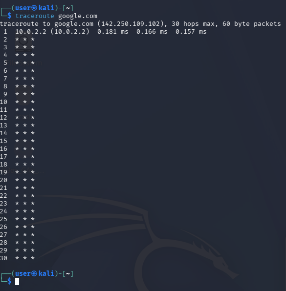
```text
traceroute google.com
Пытается показать маршрут, но видит только первый хоп (10.0.2.2), дальше * * * – значит, промежуточные роутеры не отвечают (закрыты ICMP или firewall).
```

```shell
─$ traceroute -I 8.8.8.8
traceroute to 8.8.8.8 (8.8.8.8), 30 hops max, 60 byte packets
 1  dns.google (8.8.8.8)  13.288 ms  13.366 ms  13.470 ms
```
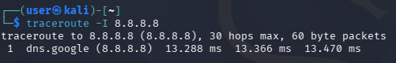
```text
traceroute -I 8.8.8.8
ICMP-трассировка – странный результат: показывает, что 8.8.8.8 достигнут за 1 прыжок. Возможно, это NAT или особенность виртуальной сети.
```

```shell
─$ sudo traceroute -T -p 443 ya.ru
[sudo] password for user: 
traceroute to ya.ru (5.255.255.242), 30 hops max, 60 byte packets
 1  ya.ru (5.255.255.242)  19.898 ms  20.412 ms  20.266 ms
```
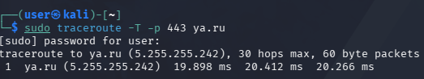
```text
sudo traceroute -T -p 443 ya.ru
TCP-трассировка на порт 443 (HTTPS) – ya.ru достигнут за 1 прыжок.
```

```shell
└─$ traceroute -n 1.1.1.1          
traceroute to 1.1.1.1 (1.1.1.1), 30 hops max, 60 byte packets
 1  10.0.2.2  0.242 ms  0.219 ms  0.210 ms
 2  * * *
 3  * * *
29  * * *
30  * * *
```
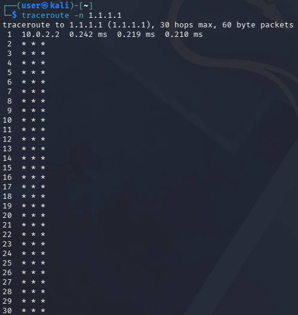
```text
traceroute -n 1.1.1.1
Без разрешения DNS-имён (флаг -n). Только первый хоп, остальные не отвечают.
```

```shell
└─$ traceroute -m 15 10.0.0.1
traceroute to 10.0.0.1 (10.0.0.1), 15 hops max, 60 byte packets
 1  10.0.2.2 (10.0.2.2)  0.252 ms  0.231 ms  0.223 ms
 2  * * *
13  * * *
14  * * *
15  * * *
```
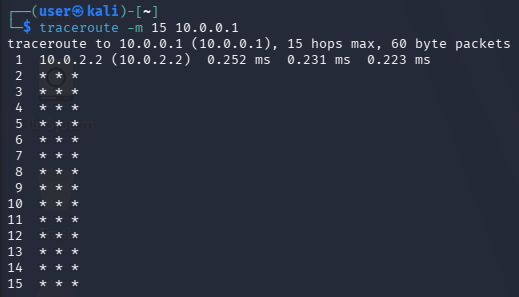
```text
traceroute -m 15 10.0.0.1
Максимум 15 прыжков до 10.0.0.1. Виден только шлюз 10.0.2.2, дальше звёзды – хост 10.0.0.1 недоступен.
```

#### ss/netstat
```shell
└─$ ss -tulpan
Netid        State         Recv-Q        Send-Q                Local Address:Port                 Peer Address:Port        Process        
udp          UNCONN        0             0                           0.0.0.0:53                        0.0.0.0:*                          
udp          UNCONN        0             0                           0.0.0.0:67                        0.0.0.0:*                          
udp          ESTAB         0             0                    10.0.2.15%eth0:68                       10.0.2.2:67                         
udp          UNCONN        0             0                              [::]:53                           [::]:*                          
tcp          LISTEN        0             32                          0.0.0.0:53                        0.0.0.0:*                          
tcp          LISTEN        0             32                             [::]:53                           [::]:*
```
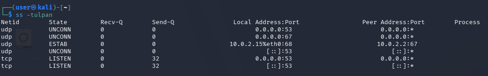
```text
ss -tulpan
Все слушающие (LISTEN) и установленные сокеты с процессами:
UDP порт 53 – DNS-сервер (слушает на всех интерфейсах)
UDP порт 67 – DHCP-сервер
UDP порт 68 – DHCP-клиент (ваша машина получила IP от 10.0.2.2:67)
TCP порт 53 – DNS через TCP
```

```shell
└─$ ss -t -a                         
State             Recv-Q            Send-Q                       Local Address:Port                          Peer Address:Port            
LISTEN            0                 32                                 0.0.0.0:domain                             0.0.0.0:*               
LISTEN            0                 32                                    [::]:domain                                [::]:*
```
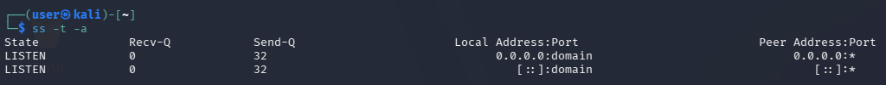
```text
ss -t -a
Все TCP-сокеты: только слушающие DNS-порты, активных соединений нет.
```

```shell
└─$ ss -u -a
State            Recv-Q            Send-Q                        Local Address:Port                         Peer Address:Port             
UNCONN           0                 0                                   0.0.0.0:domain                            0.0.0.0:*                
UNCONN           0                 0                                   0.0.0.0:bootps                            0.0.0.0:*                
ESTAB            0                 0                            10.0.2.15%eth0:bootpc                           10.0.2.2:bootps           
UNCONN           0                 0                                      [::]:domain                               [::]:*
```
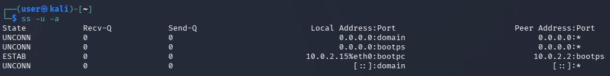
```text
ss -u -a
Все UDP-сокеты:
DNS (порт 53)
DHCP-сервер (порт 67)
DHCP-клиент (порт 68) – установлено соединение с 10.0.2.2
```

```shell
└─$ ss -s
Total: 562
TCP:   2 (estab 0, closed 0, orphaned 0, timewait 0)

Transport Total     IP        IPv6
RAW       1         0         1        
UDP       4         3         1        
TCP       2         1         1        
INET      7         4         3        
FRAG      0         0         0
```
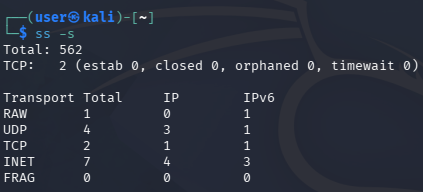
```text
ss -s
Сводная статистика:
Всего сокетов: 562 (в основном не сетевые)
TCP: 2, UDP: 4, RAW: 1
```

```shell
└─$ ss -tn state established
Recv-Q               Send-Q                              Local Address:Port                               Peer Address:Port
```
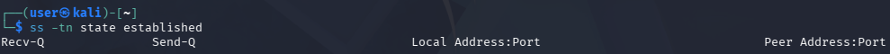
```text
ss -tn state established
Нет установленных TCP-соединений (пустой вывод).
```

```shell
─$ netstat -i              
Kernel Interface table
Iface             MTU    RX-OK RX-ERR RX-DRP RX-OVR    TX-OK TX-ERR TX-DRP TX-OVR Flg
eth0             1500     3168      0      0 0          3428      0      0      0 BMRU
eth1             1500        0      0      0 0             0      0      0      0 BMRU
lo              65536        4      0      0 0             4      0      0      0 LRU
```
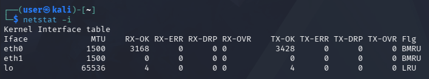
```text
netstat -i
Статистика интерфейсов:
eth0 – получено 3168 пакетов, отправлено 3428, ошибок нет
eth1 – нулевой трафик (не используется)
lo – внутренний трафик (4 пакета)
```

#### netcat(nc)
```shell
└─$ nc -zv google.com 80
DNS fwd/rev mismatch: google.com != zq-in-f139.1e100.net
DNS fwd/rev mismatch: google.com != zq-in-f113.1e100.net
DNS fwd/rev mismatch: google.com != zq-in-f102.1e100.net
DNS fwd/rev mismatch: google.com != zq-in-f101.1e100.net
DNS fwd/rev mismatch: google.com != zq-in-f100.1e100.net
DNS fwd/rev mismatch: google.com != zq-in-f138.1e100.net
google.com [142.25
```
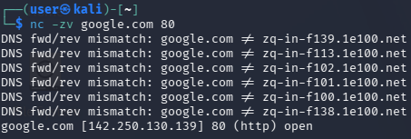
```text
nc -zv google.com 80
Проверка порта 80 на google.com:
DNS fwd/rev mismatch – обратное DNS-имя не совпадает с прямым (обычное дело для CDN)
Порт 80 доступен
```

```shell
└─$ echo "GET /" | nc google.com 80 
HTTP/1.0 200 OK
Date: Tue, 14 Apr 2026 20:49:15 GMT
Expires: -1
Cache-Control: private, max-age=0
Content-Type: text/html; charset=ISO-8859-1
Content-Security-Policy-Report-Only: object-src 'none';base-uri 'self';script-src 'nonce-r2_O2xhAhdONSVSKgtyFhA' 'strict-dynamic' 'report-sample' 'unsafe-eval' 'unsafe-inline' https: http:;report-uri https://csp.withgoogle.com/csp/gws/other-hp
P3P: CP="This is not a P3P policy! See g.co/p3phelp for more info."
Server: gws
X-XSS-Protection: 0
X-Frame-Options: SAMEORIGIN
Set-Cookie: __Secure-STRP=AEEP7gItMfeVzsdrv4WeMNiae1iWFPIAC_Z7BOeZg45kU6XP9jMzqLyBgg-XXe7iWWJaS7FtALe2HiSnL_7lJCYx01ZVGQ6cjQ; expires=Tue, 14-Apr-2026 20:54:15 GMT; path=/; domain=.google.com; Secure; SameSite=strict
Set-Cookie: AEC=AaJma5uZPLKAX0oSWLB202ASxtXfcqMOLYnFFBIis5wUozUHsPNg52jRRrI; expires=Sun, 11-Oct-2026 20:49:15 GMT; path=/; domain=.google.com; Secure; HttpOnly; SameSite=lax
Set-Cookie: NID=530=F_Kox1HAjy4AdFbKgp9kWBdtmmDRjw2Jvtvaxjys-C_ogk736RuQmMVjt1-1LxAFJtKTv00qwl4VY4P6vos1CccN18xY-AuQRejyedLiF_IMroEqoUKYPTNwyfZRzf1mjBxJEAKmN0Q_kt5TkRTs425vb5vB7zPvA9p2Yy-K3T17ciE5DQrNXaoaVLiboK_wWe84ybRiQ-lgZ51vwMRT6huA97AnrprOmw; expires=Wed, 14-Oct-2026 20:49:15 GMT; path=/; domain=.google.com; HttpOnly
Accept-Ranges: none
Vary: Accept-Encoding
```
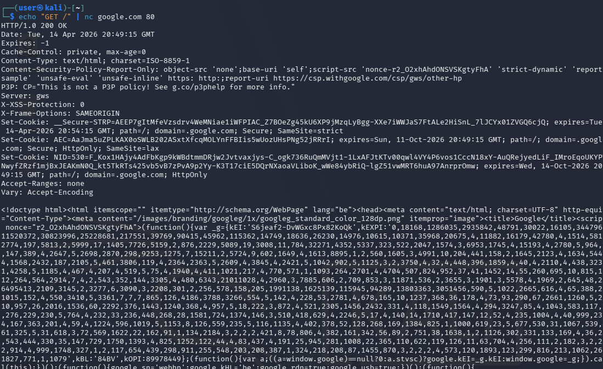
```text
echo "GET /" | nc google.com 80
Отправлен HTTP-запрос к google.com, получен ответ HTTP/1.0 200 OK с заголовками (сервер gws, cookie и т.д.)
```

```shell
└─$ nc -v 10.0.0.1 22 
10.0.0.1: inverse host lookup failed: Unknown host
(UNKNOWN) [10.0.0.1] 22 (ssh) : Connection refused
```
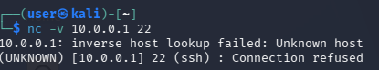
```text
nc -v 10.0.0.1 22
Попытка подключиться к SSH-порту (22) на 10.0.0.1:
Connection refused – порт закрыт или хост не слушает
```

#### dig
```shell
└─$ dig google.com

; <<>> DiG 9.20.20-1-Debian <<>> google.com
;; global options: +cmd
;; Got answer:
;; ->>HEADER<<- opcode: QUERY, status: NOERROR, id: 60217
;; flags: qr rd ra; QUERY: 1, ANSWER: 6, AUTHORITY: 0, ADDITIONAL: 1

;; OPT PSEUDOSECTION:
; EDNS: version: 0, flags:; udp: 1232
;; QUESTION SECTION:
;google.com.                    IN      A

;; ANSWER SECTION:
google.com.             192     IN      A       142.250.130.138
google.com.             192     IN      A       142.250.130.139
google.com.             192     IN      A       142.250.130.113
google.com.             192     IN      A       142.250.130.102
google.com.             192     IN      A       142.250.130.101
google.com.             192     IN      A       142.250.130.100

;; Query time: 15 msec
;; SERVER: 192.168.0.1#53(192.168.0.1) (UDP)
;; WHEN: Tue Apr 14 16:52:02 EDT 2026
;; MSG SIZE  rcvd: 135
```
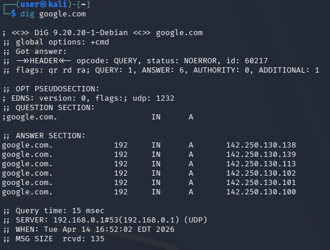
```text
dig google.com
DNS-запрос A-записей (IPv4):
Получено 6 IP-адресов для google.com (142.250.130.138, .139, .113, .102, .101, .100)
TTL 192 секунды
Сервер: 192.168.0.1#53
```

```shell
└─$ dig google.com AAA

; <<>> DiG 9.20.20-1-Debian <<>> google.com AAA
;; global options: +cmd
;; Got answer:
;; ->>HEADER<<- opcode: QUERY, status: NOERROR, id: 50380
;; flags: qr rd ra; QUERY: 1, ANSWER: 6, AUTHORITY: 0, ADDITIONAL: 1

;; OPT PSEUDOSECTION:
; EDNS: version: 0, flags:; udp: 1232
;; QUESTION SECTION:
;google.com.                    IN      A

;; ANSWER SECTION:
google.com.             33      IN      A       142.250.109.138
google.com.             33      IN      A       142.250.109.139
google.com.             33      IN      A       142.250.109.101
google.com.             33      IN      A       142.250.109.113
google.com.             33      IN      A       142.250.109.102
google.com.             33      IN      A       142.250.109.100

;; Query time: 11 msec
;; SERVER: 192.168.0.1#53(192.168.0.1) (UDP)
;; WHEN: Tue Apr 14 16:52:40 EDT 2026
;; MSG SIZE  rcvd: 135

;; Got answer:
;; ->>HEADER<<- opcode: QUERY, status: NOERROR, id: 63976
;; flags: qr rd ra ad; QUERY: 1, ANSWER: 0, AUTHORITY: 1, ADDITIONAL: 1

;; OPT PSEUDOSECTION:
; EDNS: version: 0, flags:; udp: 1232
;; QUESTION SECTION:
;AAA.                           IN      A

;; AUTHORITY SECTION:
AAA.                    900     IN      SOA     ns1.dns.nic.AAA. admin.tldns.godaddy. 1776166621 1800 300 604800 1800

;; Query time: 79 msec
;; SERVER: 192.168.0.1#53(192.168.0.1) (UDP)
;; WHEN: Tue Apr 14 16:52:40 EDT 2026
;; MSG SIZE  rcvd: 99
```
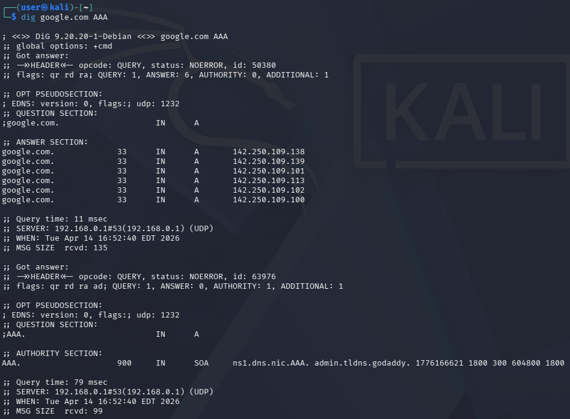
```text
dig google.com AAA (опечатка, вероятно AAAA)
Первый запрос нашёл A-записи (IPv4), второй запрос для AAA (несуществующий домен) вернул SOA-запись (указание на авторитетный сервер).
```

```shell
└─$ dig -x 8.8.8.8    

; <<>> DiG 9.20.20-1-Debian <<>> -x 8.8.8.8
;; global options: +cmd
;; Got answer:
;; ->>HEADER<<- opcode: QUERY, status: NOERROR, id: 9498
;; flags: qr rd ra; QUERY: 1, ANSWER: 1, AUTHORITY: 0, ADDITIONAL: 1

;; OPT PSEUDOSECTION:
; EDNS: version: 0, flags:; udp: 1232
;; QUESTION SECTION:
;8.8.8.8.in-addr.arpa.          IN      PTR

;; ANSWER SECTION:
8.8.8.8.in-addr.arpa.   55059   IN      PTR     dns.google.

;; Query time: 224 msec
;; SERVER: 192.168.0.1#53(192.168.0.1) (UDP)
;; WHEN: Tue Apr 14 16:53:28 EDT 2026
;; MSG SIZE  rcvd: 73
```
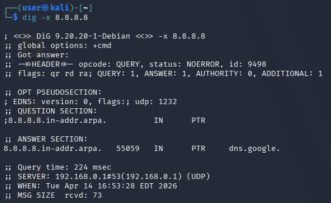
```text
dig -x 8.8.8.8
Обратный DNS-запрос (PTR-запись):
8.8.8.8 → dns.google
```

```shell
└─$ dig +short google.com
142.250.109.138
142.250.109.102
142.250.109.101
142.250.109.113
142.250.109.139
142.250.109.100
```
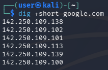
```text
dig +short google.com
Краткий вывод – только IP-адреса (без служебной информации).
```

```shell
─$ dig google.com NS    

; <<>> DiG 9.20.20-1-Debian <<>> google.com NS
;; global options: +cmd
;; Got answer:
;; ->>HEADER<<- opcode: QUERY, status: NOERROR, id: 10783
;; flags: qr rd ra; QUERY: 1, ANSWER: 4, AUTHORITY: 0, ADDITIONAL: 9

;; OPT PSEUDOSECTION:
; EDNS: version: 0, flags:; udp: 1232
;; QUESTION SECTION:
;google.com.                    IN      NS

;; ANSWER SECTION:
google.com.             54429   IN      NS      ns1.google.com.
google.com.             54429   IN      NS      ns2.google.com.
google.com.             54429   IN      NS      ns4.google.com.
google.com.             54429   IN      NS      ns3.google.com.

;; ADDITIONAL SECTION:
ns4.google.com.         54381   IN      A       216.239.38.10
ns4.google.com.         54620   IN      AAAA    2001:4860:4802:38::a
ns3.google.com.         54381   IN      A       216.239.36.10
ns3.google.com.         56727   IN      AAAA    2001:4860:4802:36::a
ns1.google.com.         54381   IN      A       216.239.32.10
ns1.google.com.         56186   IN      AAAA    2001:4860:4802:32::a
ns2.google.com.         54381   IN      A       216.239.34.10
ns2.google.com.         54507   IN      AAAA    2001:4860:4802:34::a

;; Query time: 12 msec
;; SERVER: 192.168.0.1#53(192.168.0.1) (UDP)
;; WHEN: Tue Apr 14 16:54:53 EDT 2026
;; MSG SIZE  rcvd: 287
```
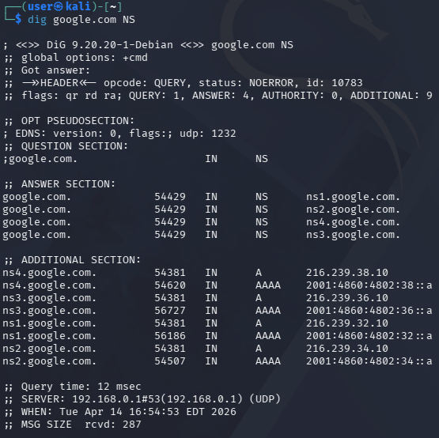
```text
dig google.com NS
NS-записи (DNS-серверы домена):
ns1.google.com, ns2.google.com, ns3.google.com, ns4.google.com
Показаны их IPv4 и IPv6 адреса
```

```shell
└─$ dig google.com MX

; <<>> DiG 9.20.20-1-Debian <<>> google.com MX
;; global options: +cmd
;; Got answer:
;; ->>HEADER<<- opcode: QUERY, status: NOERROR, id: 55485
;; flags: qr rd ra; QUERY: 1, ANSWER: 1, AUTHORITY: 0, ADDITIONAL: 1

;; OPT PSEUDOSECTION:
; EDNS: version: 0, flags:; udp: 1232
;; QUESTION SECTION:
;google.com.                    IN      MX

;; ANSWER SECTION:
google.com.             300     IN      MX      10 smtp.google.com.

;; Query time: 48 msec
;; SERVER: 192.168.0.1#53(192.168.0.1) (UDP)
;; WHEN: Tue Apr 14 16:55:39 EDT 2026
;; MSG SIZE  rcvd: 60
```
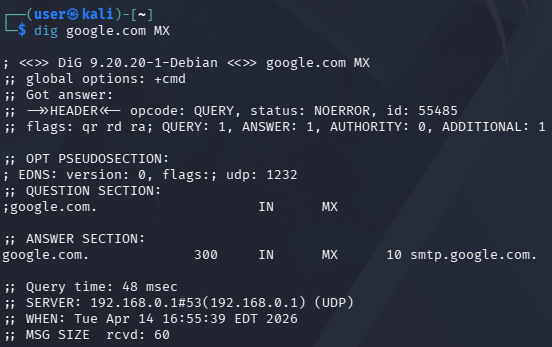
```text
dig google.com MX
MX-записи (почтовые серверы):
10 smtp.google.com – приоритет 10 (чем меньше число, тем выше приоритет)
```
___

## 2 Практика


## Часть 1: debian1 (роутер / шлюз)

## Шаг 1: Настройка сетевых интерфейсов

- `sudo dhclient enp0s3` — получить IP-адрес по DHCP для интерфейса enp0s3 (выход в интернет)

- `sudo ip link set enp0s3 up` — поднять интерфейс enp0s3

- `sudo ip addr add 10.0.1.1/24 dev enp0s8` — назначить статический IP 10.0.1.1 для интерфейса enp0s8 (сеть NAT1, связь с Kali)

- `sudo ip link set enp0s8 up` — поднять интерфейс enp0s8

- `sudo ip addr add 10.0.2.1/24 dev enp0s9` — назначить статический IP 10.0.2.1 для интерфейса enp0s9 (сеть NAT2, связь с debian2)

- `sudo ip link set enp0s9 up` — поднять интерфейс enp0s9

- `ip a show enp0s3` — проверить IP-адрес на интерфейсе enp0s3

- `ip a show enp0s8` — проверить IP-адрес на интерфейсе enp0s8

- `ip a show enp0s9` — проверить IP-адрес на интерфейсе enp0s9

---

## Шаг 2: Включение IP-форвардинга (маршрутизации)

- `echo 1 | sudo tee /proc/sys/net/ipv4/ip_forward` — временно включить IP-форвардинг до перезагрузки

- `echo "net.ipv4.ip_forward=1" | sudo tee -a /etc/sysctl.conf` — добавить параметр в конфиг для постоянного включения

- `sudo sysctl -p` — применить изменения из файла sysctl.conf

- `cat /proc/sys/net/ipv4/ip_forward` — проверить, что IP-форвардинг включён (должен вернуть 1)

---

## Шаг 3: Настройка NAT с помощью iptables

- `sudo iptables -t nat -A POSTROUTING -o enp0s3 -j MASQUERADE` — включить маскарадинг для выхода в интернет через enp0s3

- `sudo iptables -A FORWARD -i enp0s8 -o enp0s3 -j ACCEPT` — разрешить пересылку пакетов из сети NAT1 (Kali) в интернет

- `sudo iptables -A FORWARD -i enp0s9 -o enp0s3 -j ACCEPT` — разрешить пересылку пакетов из сети NAT2 (debian2) в интернет

- `sudo iptables -A FORWARD -i enp0s8 -o enp0s9 -j ACCEPT` — разрешить пересылку пакетов из NAT1 в NAT2 (Kali → debian2)

- `sudo iptables -A FORWARD -i enp0s9 -o enp0s8 -j ACCEPT` — разрешить пересылку пакетов из NAT2 в NAT1 (debian2 → Kali)

- `sudo iptables -A FORWARD -i enp0s3 -o enp0s8 -m state --state RELATED,ESTABLISHED -j ACCEPT` — разрешить обратные ответы из интернета в NAT1

- `sudo iptables -A FORWARD -i enp0s3 -o enp0s9 -m state --state RELATED,ESTABLISHED -j ACCEPT` — разрешить обратные ответы из интернета в NAT2

- `sudo iptables -L -n -v` — просмотреть все правила фильтрации (FORWARD, INPUT, OUTPUT)

- `sudo iptables -t nat -L -n -v` — просмотреть правила NAT (таблица nat)

---

## Шаг 4: Сохранение правил iptables

- `sudo apt update` — обновить список пакетов

- `sudo apt install iptables-persistent -y` — установить утилиту для сохранения правил iptables

- `sudo iptables-save | sudo tee /etc/iptables/rules.v4` — вручную сохранить текущие правила iptables в файл

---

## Шаг 5: Настройка DNS на debian1

- `echo "nameserver 8.8.8.8" | sudo tee /etc/resolv.conf` — прописать DNS-сервер Google (8.8.8.8)

- `sudo nano /etc/systemd/resolved.conf` — открыть конфиг systemd-resolved (если resolv.conf перезаписывается)

- `sudo systemctl restart systemd-resolved` — перезапустить службу systemd-resolved после изменений

- `ping -c 4 8.8.8.8` — проверить доступ в интернет (пинг до IP Google)

- `ping -c 2 google.com` — проверить разрешение DNS-имён (пинг до домена)
---

# Kali (клиент в сети NAT1)

## Шаг 1: Настройка сетевого интерфейса

- `sudo ip addr add 10.0.1.2/24 dev eth0` — назначить статический IP-адрес 10.0.1.2 на интерфейс eth0

- `sudo ip link set eth0 up` — поднять интерфейс eth0

- `sudo ip route add default via 10.0.1.1 dev eth0` — добавить шлюз по умолчанию (debian1 с адресом 10.0.1.1)

- `ip a show eth0` — проверить, что IP-адрес назначен правильно

- `ip route` — проверить, что маршрут по умолчанию добавлен

---

## Шаг 2: Настройка DNS на Kali

- `echo "nameserver 8.8.8.8" | sudo tee /etc/resolv.conf` — прописать DNS-сервер Google (8.8.8.8)

- `cat /etc/resolv.conf` — проверить содержимое файла DNS

---

## Шаг 3: Проверка связи

- `ping -c 4 10.0.1.1` — проверить связь с debian1 (шлюзом)

- `ping -c 4 10.0.2.2` — проверить связь с debian2 (через роутер)

- `ping -c 4 8.8.8.8` — проверить доступ в интернет (пинг до IP Google)

- `ping -c 2 google.com` — проверить разрешение DNS-имён

---

## Шаг 4: Постоянная настройка (сохранение после перезагрузки)

- `sudo nano /etc/network/interfaces` — открыть конфигурационный файл сетевых интерфейсов

- Добавить в файл следующие строки:
    - `auto eth0`
    - `iface eth0 inet static`
    - `address 10.0.1.2`
    - `netmask 255.255.255.0`
    - `gateway 10.0.1.1`

- `sudo systemctl restart networking` — перезапустить сетевую службу для применения изменений

- `sudo systemctl restart NetworkManager` — альтернативная команда, если используется NetworkManager

---

## Шаг 5: Дополнительные проверки (диагностика)

- `ip route show default` — проверить маршрут по умолчанию

- `ip neigh show dev eth0` — показать ARP-таблицу на интерфейсе eth0 (соседи по сети)

- `traceroute 8.8.8.8` — просмотреть маршрут до интернета

- `dig google.com` — выполнить DNS-запрос для проверки резолвинга

---

# debian2 (клиент в сети NAT2)

## Шаг 1: Настройка сетевого интерфейса

- `sudo ip addr add 10.0.2.2/24 dev enp0s3` — назначить статический IP-адрес 10.0.2.2 на интерфейс enp0s3

- `sudo ip link set enp0s3 up` — поднять интерфейс enp0s3

- `sudo ip route add default via 10.0.2.1 dev enp0s3` — добавить шлюз по умолчанию (debian1 с адресом 10.0.2.1)

- `ip a show enp0s3` — проверить, что IP-адрес назначен правильно

- `ip route` — проверить, что маршрут по умолчанию добавлен

---

## Шаг 2: Настройка DNS на debian2

- `echo "nameserver 1.1.1.1" | sudo tee /etc/resolv.conf` — прописать DNS-сервер Cloudflare (1.1.1.1) согласно заданию

- `cat /etc/resolv.conf` — проверить содержимое файла DNS

---

## Шаг 3: Проверка связи

- `ping -c 4 10.0.2.1` — проверить связь с debian1 (шлюзом)

- `ping -c 4 8.8.8.8` — проверить доступ в интернет через debian1 (пинг до IP Google)

- `ping -c 2 google.com` — проверить разрешение DNS-имён

- `dig google.com | grep SERVER` — проверить, что используется DNS-сервер 1.1.1.1

---

## Шаг 4: Постоянная настройка (сохранение после перезагрузки)

- `sudo nano /etc/network/interfaces` — открыть конфигурационный файл сетевых интерфейсов

- Добавить в файл следующие строки:
    - `auto enp0s3`
    - `iface enp0s3 inet static`
    - `address 10.0.2.2`
    - `netmask 255.255.255.0`
    - `gateway 10.0.2.1`

- `sudo systemctl restart networking` — перезапустить сетевую службу для применения изменений

- `sudo systemctl restart NetworkManager` — альтернативная команда, если используется NetworkManager

---
### пинг с debian 2
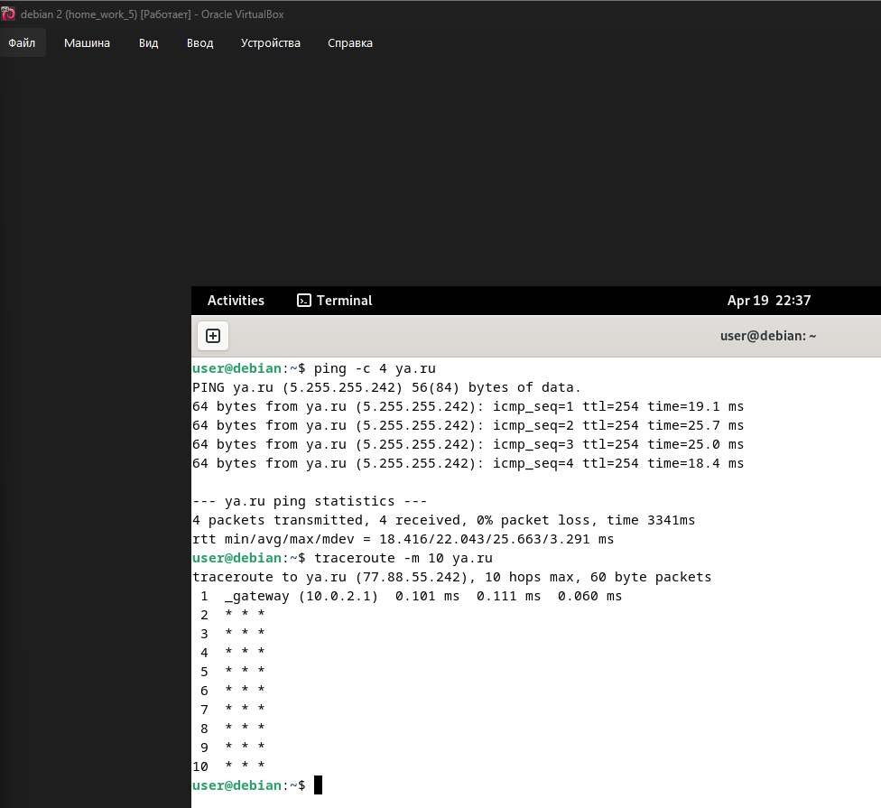

### DNS
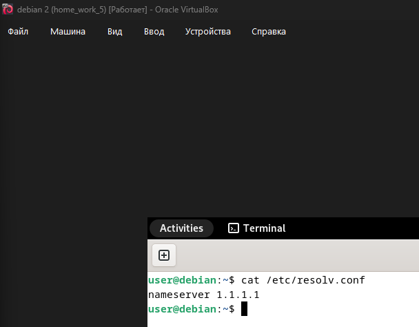
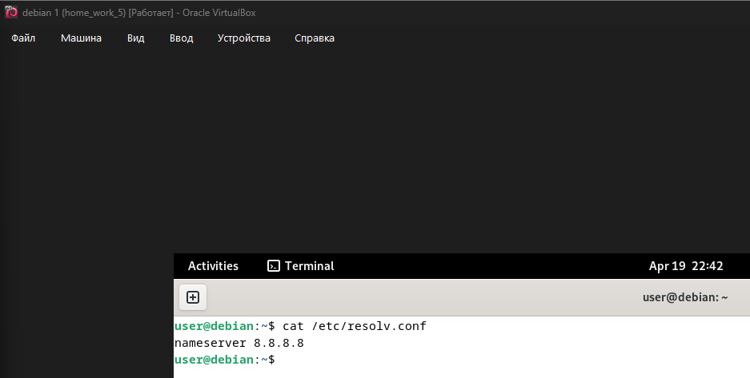

### SSH
## kali -> debian1 -> debian2
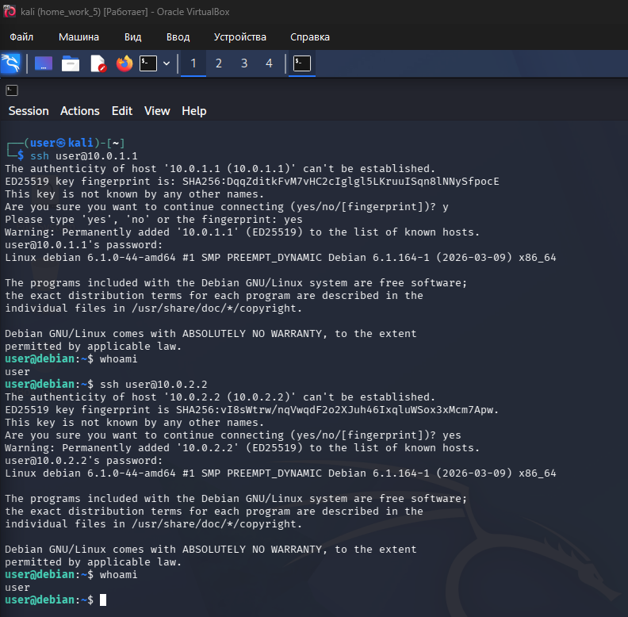
